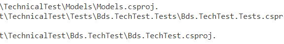
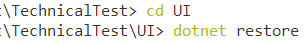
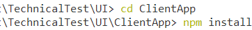
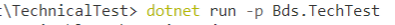
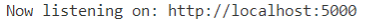
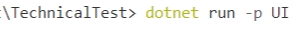

# Guide to run the project

There are three applications that can be run individually. 
* Web App powered by .Net Core and Angular.
* Web API powered by .Net Core and Swagger.
* Unit Tests powered by NUnit

### Restoring packages for the project

> Open the Terminal, run the command in the following location:

> Run in .\TechnicalTest root folder (.Net Package restoring three projects)       
> 

> Run in .\TechnicalTest\UI root folder (.Net Package restoring UI Project)          
> 

> Run in .\TechnicalTest\UI\ClientApp root folder (Npm Package restoring UI Project)
> 

### Web API

> Open the Terminal, run the command in the following location:
> 

> Click the link                                                
> 

> This will take to Swagger API page.                           
> 

### Web App

> Open the Terminal, run the command in the following location:
> 

> Click one of the links                                       
> 

> This will take to the website.                               
> 

### Unit Test

> Open the Terminal, run the command in the following location:
> 
