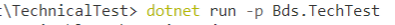
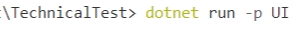
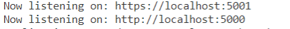
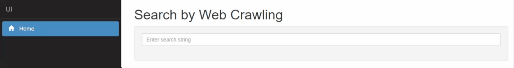
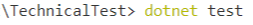

# Guide to run the project

There are three applications that can be run individually. 
* Web App powered by .Net Core and Angular.
* Web API powered by .Net Core and Swagger.
* Unit Tests powered by NUnit

### Web API

> Open the Terminal, run the command in the following location:
> 

> Click the link
> 

> This will take to Swagger API page.
> 

### Web App

> Open the Terminal, run the command in the following location:
> 

> Click one of the links
> 

> This will take to the website.
> 

### Unit Test

> Open the Terminal, run the command in the following location:
> 
